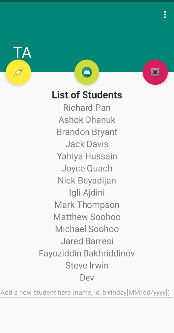
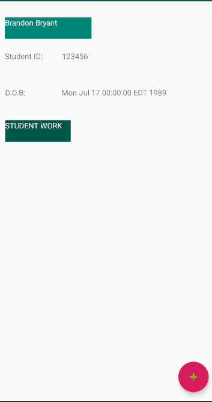
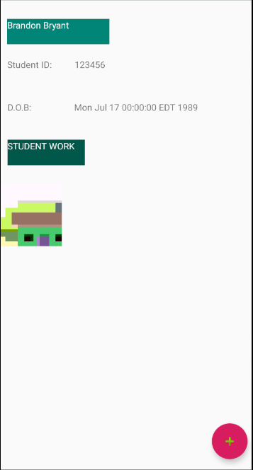

# TA_App_Google_Bootcamp
 Teaching assistant app created during Google JTerm Bootcamp 2020
 Created using Android Studio and Java
 By Brandon Bryant, Richard Pan, and Ashok Dhanuk

User is able to add/delete students.
Selecting a student brings user to an information page which includes name,id, etc.
Information page also includes list of images associated with that studen.
New images may be taken through the app, on the info page, which will then be assigned to that student. 

